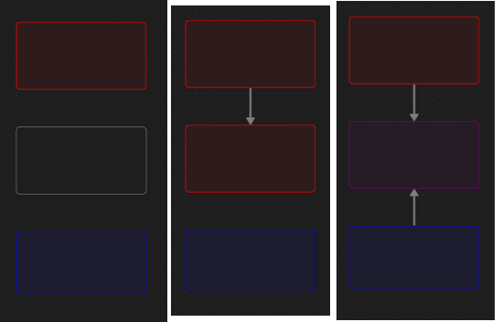

# Canvas Color Blender Plugin for ObsidianMD

This plugin automatically adjusts the color of "blank" nodes based on the colors of the nodes they are connected to. It simplifies managing node aesthetics by blending colors from edges, providing a more dynamic and visually intuitive graph.

## Features

- **Automatic Node Color Blending**: When you create an edge between two colored nodes and a blank node, the blank node's color is automatically updated to a blend of the connected node colors.
- **Supports Multiple Nodes**: The plugin works seamlessly whether you're connecting two or more colored nodes to a blank node.
- **Color Blending**: If a blank node is connected to a blue node and a red node, it will turn purple (or the equivalent color blend).

### Example

## Installation

1. Download the plugin files and place them in your ObsidianMD `plugins` folder.
2. Enable the plugin from Obsidian's settings menu under the "Community Plugins" section.
3. Start creating nodes & edges then watch blank nodes dynamically change color as edges are made.

## Usage

1. Create nodes and assign colors to them using the built-in color system or custom attributes.
2. Add a blank node (one without a color).
3. Create edges between the colored nodes and the blank node.
4. The blank node will automatically update to a blended color based on its connections.

## Customization

- You can adjust the color blending behavior by modifying the plugin settings.
- The plugin supports both default and custom colors.

## Compatibility

This plugin was built for ObsidianMD version `1.6.7`.

## Feedback & Contributions

Feel free to open an issue or submit a pull request on GitHub if you'd like to suggest features or report bugs!
